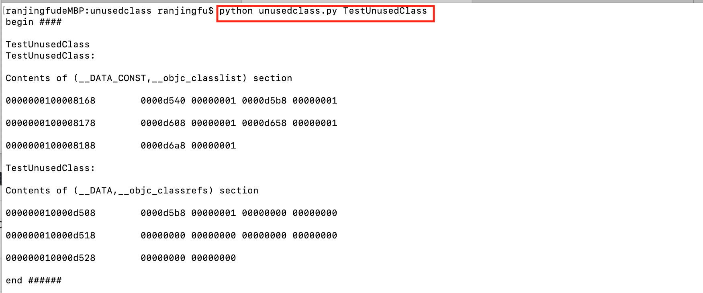

# unusedclass
a python code for scan unusedclass in MachO file

## 介绍
a python code for scan unusedclass in MachO file

## 安装
Python3  Mac OS X 10.15.7(开发环境)

## 使用
1.打开命令行工具
2.输入命令  `python unusedclass.py #Mach-O Path`
3.

## 联系方式
- 落叶情思  a20201313@163.com

## 开源协议
项目开源协议，MIT License 。

